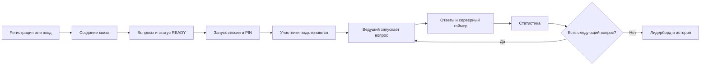

# QuizTime

QuizTime — учебное веб-приложение для проведения интерактивных квизов в реальном времени.

Организатор создаёт квиз, добавляет вопросы, запускает игровую сессию и передаёт участникам шестизначный PIN. Участники подключаются, отвечают на вопросы в заданное время и получают итоговый результат.

## Возможности

- регистрация, вход и выход через защищённую HTTP-only cookie;
- создание квизов с категориями, черновиками и статусом готовности;
- вопросы с одиночным и множественным выбором, а также изображениями;
- игровая сессия с уникальным PIN и realtime-лобби;
- серверный таймер, один ответ на вопрос и серверное начисление фиксированных баллов;
- статистика ответа, итоговый лидерборд и сохранённая история игр;
- переподключение к lobby, активному вопросу, review и финальному результату;
- адаптивные экраны участника для мобильных устройств.

## Стек

- Frontend: React, Vite, React Router, Socket.IO Client.
- Backend: Node.js, Express, Socket.IO, Prisma, PostgreSQL.
- Проверка данных и безопасность: Zod, bcrypt, JWT, cookie-parser, Multer.
- Тесты: Vitest, Supertest, socket.io-client.

## Быстрый запуск

Требуются Node.js 20 или новее, Docker Desktop и Docker Compose.

```powershell
Copy-Item .env.example .env
docker compose up -d
npm.cmd --prefix backend ci
npm.cmd --prefix frontend ci
npm.cmd --prefix backend run prisma:migrate:deploy
npm.cmd --prefix backend run prisma:seed
```

В двух отдельных терминалах запустите backend и frontend:

```powershell
npm.cmd --prefix backend run dev
```

```powershell
npm.cmd --prefix frontend run dev
```

Откройте [http://localhost:5173](http://localhost:5173). Проверка backend доступна по [http://localhost:3000/api/health](http://localhost:3000/api/health).

## Переменные окружения

Создайте корневой `.env` на основе `.env.example`.

| Переменная | Назначение |
|---|---|
| `NODE_ENV` | режим запуска, для локальной разработки — `development` |
| `PORT` | порт backend, по умолчанию `3000` |
| `DATABASE_URL` | подключение к PostgreSQL |
| `JWT_SECRET` | случайная строка длиной не менее 32 символов |

Файл `.env`, пользовательские изображения вопросов и данные PostgreSQL не добавляются в Git.

## Проверки качества

```powershell
npm.cmd --prefix backend run lint
npm.cmd --prefix backend test
npm.cmd --prefix backend run prisma:validate
npm.cmd --prefix frontend run lint
npm.cmd --prefix frontend run build
```

## Основной сценарий



## Архитектура

В разработке браузер работает с Vite на `5173`, а proxy передаёт `/api`, `/uploads` и `/socket.io` на Express/Socket.IO на `3000`.

PostgreSQL — источник бизнес-данных: квизов, сессий, участников, ответов и результатов. Сервер отвечает за права, состояние игры, deadline, проверку ответов и начисление баллов. Клиент не получает правильные варианты до этапа review.

## Материалы проекта

- [Макеты интерфейса в Figma](https://www.figma.com/design/MfPaWPpgSSgLRSNzr10anr/Untitled?node-id=0-1&t=WbMlmLzG85pGNkaB-1)
- Сценарий пользователя приведён в Mermaid-диаграмме выше.
- Подробные локальные материалы по API, базе данных, realtime и пользовательскому тестированию хранятся в папке `docs/`.

## Ограничения MVP

В проект не входят гостевой вход, глобальные роли, бонус за скорость, частичные баллы, команды, QR-коды, чат, общий публичный каталог квизов и production-деплой. Деплой возможен только после отдельной настройки единого HTTPS-origin и постоянного хранилища загрузок.
